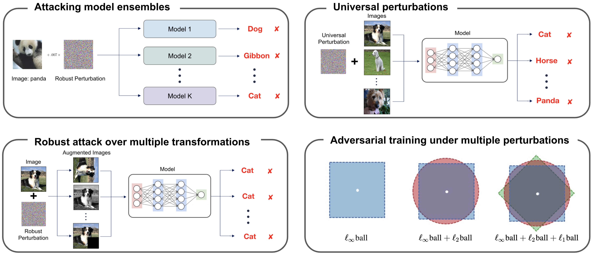

# Adversarial Attack Generation Empowered by Min-Max Optimization

[[`Paper`]()]
[[`arXiv`](https://arxiv.org/abs/1906.03563)]
[[`Project Page`](http://www.cs.toronto.edu/~wangjk/publications/minmax-adv.html)]

> [Adversarial Attack Generation Empowered by Min-Max Optimization]()  
> Jingkang Wang, Tianyun Zhang, Sijia Liu,  Pin-Yu Chen, Jiacen Xu, Makan Fardad, Bo Li
> NeurIPS 2021  

<div align="center">
    <br>
    Revisit the strength of min-max optimization in the context of  adversarial attack generation
</div>

## Reproduce the results 
TBD

## Citation
If you find our code or paper useful, please consider citing
```bibtex
@inproceedings{wang2021adversarial,
    title={Adversarial Attack Generation Empowered by Min-Max Optimization},
    author={Wang, Jingkang and Zhang, Tianyun and Liu, Sijia  and Chen, Pin-Yu and Xu, Jiacen and Fardad, Makan and Li, Bo},
    booktitle={Advances in Neural Information Processing Systems (NeurIPS)},
    year={2021}
}
```

## Questions/Bugs
Please submit a Github issue or contact wangjk@cs.toronto.edu if you have any questions or find any bugs.